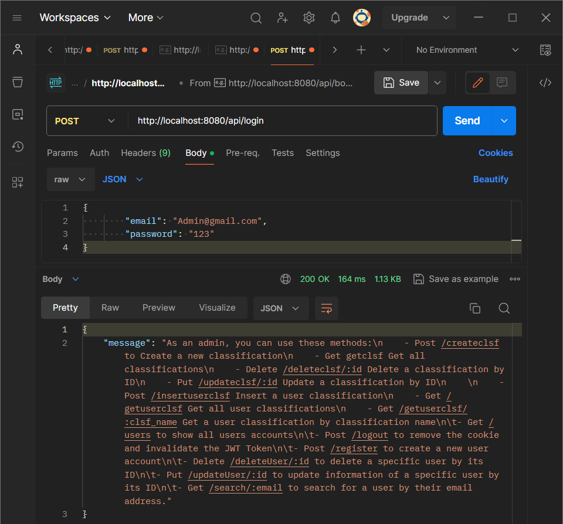
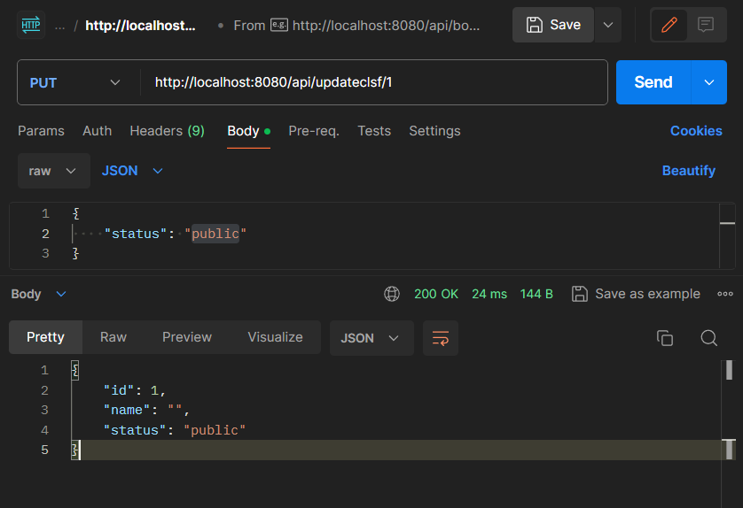

# User Handlers Package

This package provides a set of HTTP endpoints for user management and authentication. It's built with Fiber, a fast and flexible web framework for Go, and GORM for ORM.

## Getting Started

To get started, you need to have Go installed on your machine.

Clone the repository:
git clone https://github.com/maramilod/SadeemTech-Task.git

## Endpoints

### User Login

To log in a user, send a POST request to `/login` with the following JSON body:json { "email": "Admin@gmail.com", "password": "123" }

### User Registration

To register a new user, send a POST request to `/register` with the following JSON body:json { "name": "omar", "email": "omar@example.com", "password": "password123", "role": "admin" }

### User Logout

To log out a user, send a POST request to `/logout`.

### User Update

Admin method To update a user's information, send a PUT request to `/updateUser/:id` with the new user information in the JSON body.

user method To update a user's information, send a PUT request to `/updateUser/:id` with the new user information in the JSON body.

### User Deletion

Admin method To delete a user, send a DELETE request to `/deleteUser/:id`.

user method To delete an account and logout, send a DELETE request to `/deleteAccount`.
### Search User

To search for a user by email, send a GET request to `/search/:email`.

### Admin Methods

- **Create Classification**: Send a POST request to `/createclsf` with the classification details.

- **Get All Classifications**: Send a GET request to `/getclsf`.

- **Update Classification**: Send a PUT request to `/updateclsf/:id` with the updated classification details.

- **Delete Classification**: Send a DELETE request to `/deleteclsf/:id`.
## Conclusion

This package provides a comprehensive set of user management features. It's designed to be easy to use, with clear and concise documentation for each endpoint.

This project is still under development to add translation and paginated
